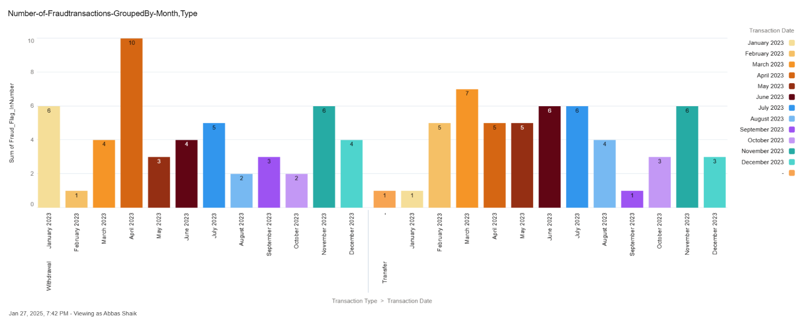
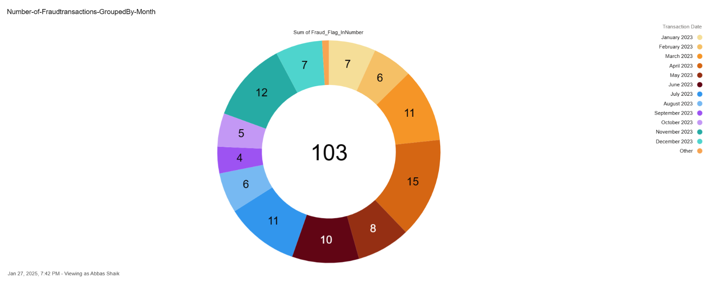
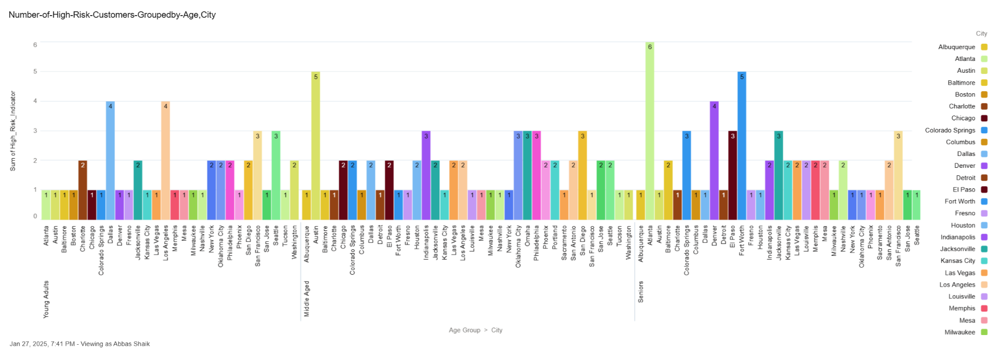
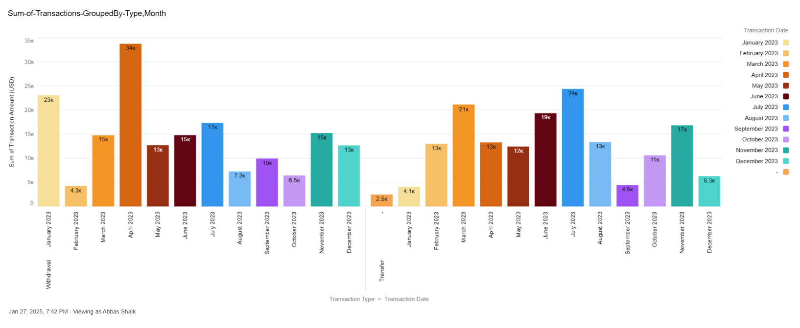

# CRM Financial Dashboard

## Overview
This project demonstrates the development of a **Customer Relationship Management (CRM) dashboard** in **Salesforce** for financial services companies. It integrates **Oracle database** data into Salesforce using **MuleSoft**, calculates **customer financial risk scores**, and detects **fraudulent transactions** using an **external Flask API** deployed on **Heroku**. Additionally, **Salesforce dashboards** visualize fraud and risk insights.

### Key Features:
- **Oracle-Salesforce Integration**: Data is synchronized from **Oracle database** to Salesforce using **MuleSoft**.
- **Risk Score Calculation**: **Apex batch logic** evaluates customer **financial behavior** and assigns a **Risk_Score__c**.
- **Fraud Detection**: **Python Flask API** flags potential **fraudulent transactions** based on predefined rules.
- **Salesforce Dashboards**: Interactive reports for **fraud trends and high-risk customers**.

---

## Architecture
### 1. Data Integration Flow (Oracle to Salesforce)
The MuleSoft integration consists of the following steps:
1. **Oracle Database Query**:
   - Retrieves customer and financial data from the Oracle database.
2. **Data Transformation**:
   - Maps the data fields to match Salesforce objects.
3. **Salesforce Data Insertion**:
   - Inserts transformed data into Salesforce custom objects.
4. **Batch Processing**:
   - Processes large data efficiently in Salesforce.

### 2. Apex-Based Risk and Fraud Analysis
1. **Financial Risk Calculation**:
   - Evaluates a customer’s **credit utilization, transaction types, and account balances** to determine a **Risk Score**.
   - **Classes Used:**
     - `FinancialRiskCalculator.cls`
     - `FinancialRiskBatch.cls`
2. **Fraud Detection**:
   - Uses **Apex Queueable & Batch classes** to call an **external Flask API** hosted on **Heroku**.
   - API returns a **fraud score**, and transactions are flagged accordingly in **Salesforce (Fraud_Flag__c)**.
   - **Classes Used:**
     - `FraudDetectionBatch.cls`
     - `FraudDetectionQueueable.cls`

---

## How Risk_Score__c and Fraud_Flag__c Are Calculated

### **Risk Score Calculation**
- **Credit Utilization**: `(Credit Card Balance / Credit Limit) * 0.7`
- **Transaction Type Weighting**:
  - **Withdrawals**: `-50%` of transaction amount.
  - **Transfers**: `+30%` of transaction amount.
  - **Deposits**: `+100%` of transaction amount.
- **Account Balance Consideration**:
  - If **balance after transaction < 100** → `-50 points`.
  - If **balance after transaction > 100** → `+20 points`.
- **Final Calculation**:
  ```math
  Risk_Score = (credit_utilization * 0.7) + transaction_score
  ```

### **Fraud Flag Calculation (Fraud_Flag__c)**
- Fraud detection API evaluates:
  - **Transaction Type** (`Deposit`, `Withdrawal`, `Transfer`)
  - **Transaction Amount**
  - **Account Balance After Transaction**
- If `fraudScore > 70` → **Fraud_Flag__c = True**.

---

# Fraud Detection API Documentation

## API Endpoint:
- **Base URL:** `https://fraud-detection-mycrm-b3cc67b1b034.herokuapp.com/fraud-detection`
- **Method:** `POST`
- **Content-Type:** `application/json`

---

## Request

### **Request Body:**
The API expects a **JSON payload** containing the following fields:

```json
{
  "transactionAmount": 5000,
  "transactionType": "Withdrawal",
  "accountBalanceAfter": 200
}
```

| Parameter             | Type    | Required | Description                                      |
|----------------------|--------|----------|--------------------------------------------------|
| `transactionAmount`  | Number | ✅ Yes    | The amount involved in the transaction.         |
| `transactionType`    | String | ✅ Yes    | Type of transaction (`Deposit`, `Withdrawal`, `Transfer`). |
| `accountBalanceAfter`| Number | ✅ Yes    | The account balance after the transaction.      |

---

## Response

### **Success Response:**
If the request is valid, the API returns a **JSON response** with the **fraud score** and a **decision** on whether the transaction needs further review.

```json
{
  "fraudScore": 80,
  "decision": "Review"
}
```

| Parameter   | Type    | Description                                      |
|------------|--------|--------------------------------------------------|
| `fraudScore` | Number | A calculated fraud score based on the rules.   |
| `decision`  | String | The decision (`Review` or `Approve`) based on the fraud score. |

---

## Fraud Detection Rules:
The fraud detection API follows predefined **business logic** to calculate the fraud score:

1. **Transaction Type:**
   - **Deposit** → Low fraud risk (**+10** points).
   - **Withdrawal** → Medium fraud risk (**+30** points).
   - **Transfer** → High fraud risk (**+50** points).

2. **Transaction Amount:**
   - **> $10,000** → **+50** fraud score.
   - **> $5,000** → **+30** fraud score.
   - **> $1,000** → **+10** fraud score.

3. **Account Balance After Transaction:**
   - **Balance < $0** → **+50** fraud score.
   - **Balance < $500** → **+30** fraud score.

### **Fraud Score Interpretation:**
- **`fraudScore <= 70`** → `"decision": "Approve"`
- **`fraudScore > 70`** → `"decision": "Review"`

---


## Advanced Reports & Dashboards in Salesforce

I leveraged **my expertise in Salesforce Reports & Dashboards** to create **interactive visualizations** that provide actionable insights into **customer financial behavior and fraud detection trends**.

### **Key Dashboard Insights:**
1. **Fraud Trends Analysis**  
   - Used **Fraud_Flag__c** to create a **row-level summary** to count flagged transactions.
   - Grouped transactions by **month and type** using **bucket fields**.
   - Helps in identifying **seasonal fraud trends**.

2. **High-Risk Customer Segmentation**  
   - Utilized **Risk_Score__c** with **formula fields** to categorize customers into **risk groups**.
   - Created **bar charts grouped by age and city** to visualize **geographical fraud risks**.

3. **Transaction Volume Breakdown**  
   - **Formula fields** were used to calculate the **total sum of transactions** by type.
   - **Row-level summaries** helped in aggregating **monthly transaction trends**.

4. **Fraud Score-Based Review Reports**  
   - Created reports that dynamically **highlight transactions exceeding fraud thresholds**.
   - Designed **dashboard filters** for quick **drill-down analysis**.

### **Salesforce Reporting Techniques Used:**
- **Row-Level Summary Fields**: Aggregating fraud transactions & financial data.
- **Formula Fields**: Categorizing customers based on **risk score brackets**.
- **Bucket Fields**: Grouping transactions into **fraud risk categories**.
- **Dashboard Filters**: Enabling **dynamic data exploration**.
- **Conditional Formatting**: Highlighting **high-risk transactions**.

💡 **This demonstrates my strong skills in Salesforce reporting and dashboard creation, making complex data more actionable and visually insightful!**


## Screenshots

### 1. **Number of Fraud Transactions (By Month & Type)**
📊 **Chart:** Fraud transactions grouped by **month** and **transaction type**  


### 2. **Fraud Transactions (Monthly Summary)**
📊 **Chart:** Total **fraudulent transactions per month**  


### 3. **High-Risk Customers (Grouped by Age & City)**
📊 **Chart:** Distribution of **high-risk customers** across different **age groups** and **cities**  


### 4. **Total Transactions (By Type & Month)**
📊 **Chart:** Monthly **transaction amounts** based on **transaction type**  



---


